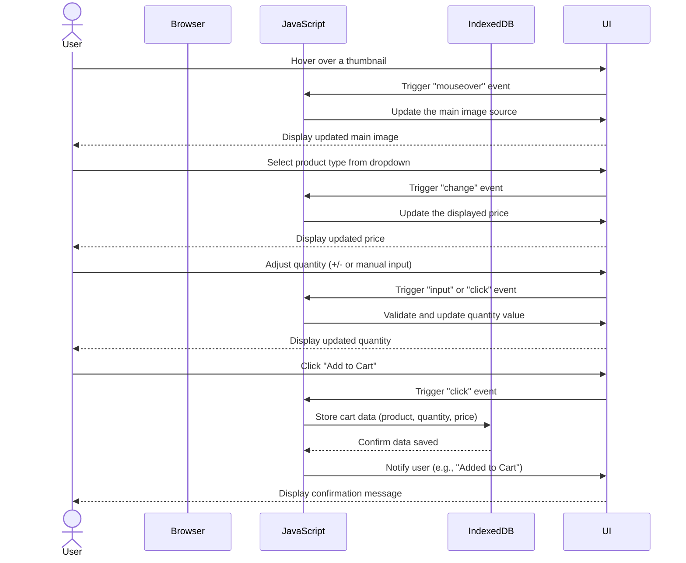

```mermaid
sequenceDiagram
actor User
participant Browser
participant JavaScript
participant IndexedDB
participant UI

User->>UI: Hover over a thumbnail
UI->>JavaScript: Trigger "mouseover" event
JavaScript->>UI: Update the main image source
UI-->>User: Display updated main image

User->>UI: Select product type from dropdown
UI->>JavaScript: Trigger "change" event
JavaScript->>UI: Update the displayed price
UI-->>User: Display updated price

User->>UI: Adjust quantity (+/- or manual input)
UI->>JavaScript: Trigger "input" or "click" event
JavaScript->>UI: Validate and update quantity value
UI-->>User: Display updated quantity

User->>UI: Click "Add to Cart"
UI->>JavaScript: Trigger "click" event
JavaScript->>IndexedDB: Store cart data (product, quantity, price)
IndexedDB-->>JavaScript: Confirm data saved
JavaScript->>UI: Notify user (e.g., "Added to Cart")
UI-->>User: Display confirmation message

```
