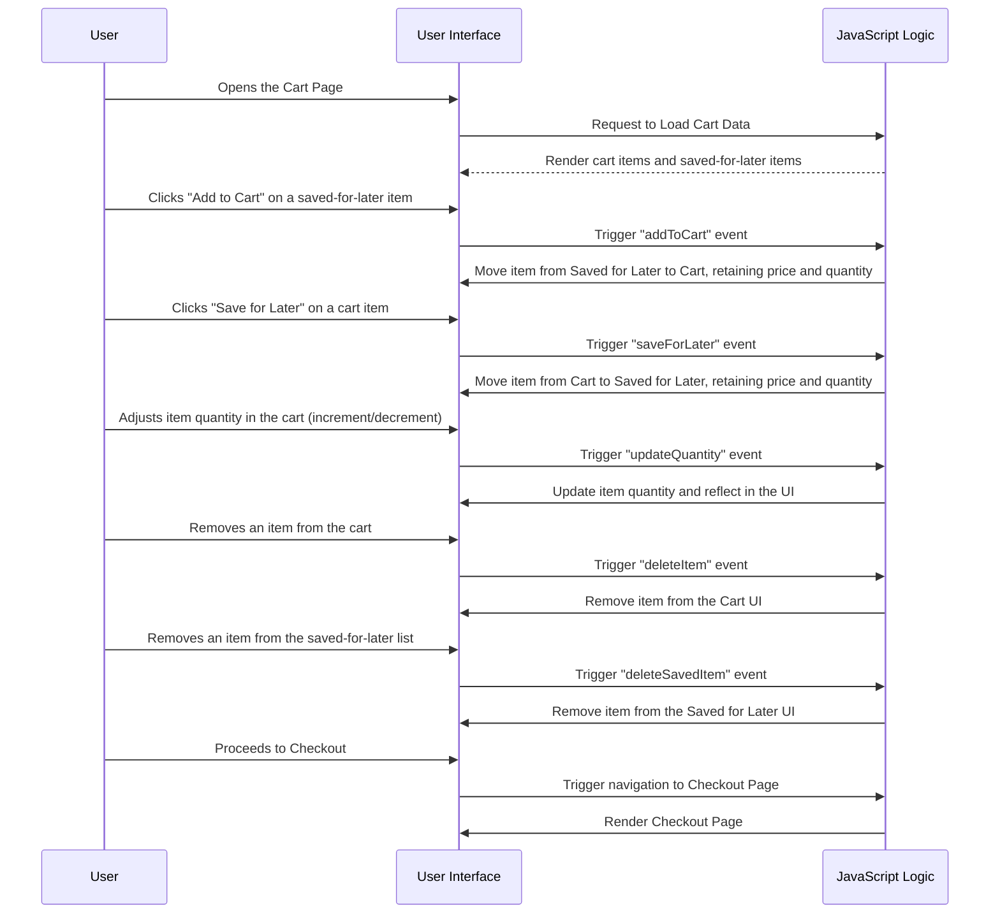

```mermaid
sequenceDiagram
    participant User
    participant UI as User Interface
    participant JS as JavaScript Logic

    User->>UI: Opens the Cart Page
    UI->>JS: Request to Load Cart Data
    JS-->>UI: Render cart items and saved-for-later items

    User->>UI: Clicks "Add to Cart" on a saved-for-later item
    UI->>JS: Trigger "addToCart" event
    JS->>UI: Move item from Saved for Later to Cart, retaining price and quantity

    User->>UI: Clicks "Save for Later" on a cart item
    UI->>JS: Trigger "saveForLater" event
    JS->>UI: Move item from Cart to Saved for Later, retaining price and quantity

    User->>UI: Adjusts item quantity in the cart (increment/decrement)
    UI->>JS: Trigger "updateQuantity" event
    JS->>UI: Update item quantity and reflect in the UI

    User->>UI: Removes an item from the cart
    UI->>JS: Trigger "deleteItem" event
    JS->>UI: Remove item from the Cart UI

    User->>UI: Removes an item from the saved-for-later list
    UI->>JS: Trigger "deleteSavedItem" event
    JS->>UI: Remove item from the Saved for Later UI

    User->>UI: Proceeds to Checkout
    UI->>JS: Trigger navigation to Checkout Page
    JS->>UI: Render Checkout Page
```
