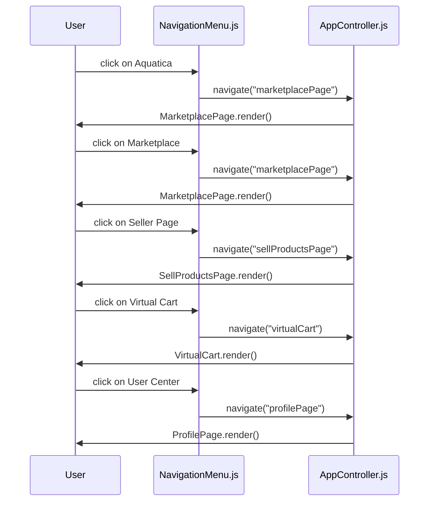

This feature is the Navigation Menu. The Navigation Menu allows the user to navigate to different pages on the site by use of the AppController.

```mermaid 
sequenceDiagram;
    User->>NavigationMenu.js: click on Aquatica;
    NavigationMenu.js->>AppController.js: navigate("marketplacePage");
    AppController.js->>User: MarketplacePage.render();
    User->>NavigationMenu.js: click on Marketplace;
    NavigationMenu.js->>AppController.js: navigate("marketplacePage");
    AppController.js->>User: MarketplacePage.render();
    User->>NavigationMenu.js: click on Seller Page;
    NavigationMenu.js->>AppController.js: navigate("sellProductsPage");
    AppController.js->>User: SellProductsPage.render();
    User->>NavigationMenu.js: click on Virtual Cart;
    NavigationMenu.js->>AppController.js: navigate("virtualCart");
    AppController.js->>User: VirtualCart.render();
    User->>NavigationMenu.js: click on User Center;
    NavigationMenu.js->>AppController.js: navigate("profilePage");
    AppController.js->>User: ProfilePage.render();
```