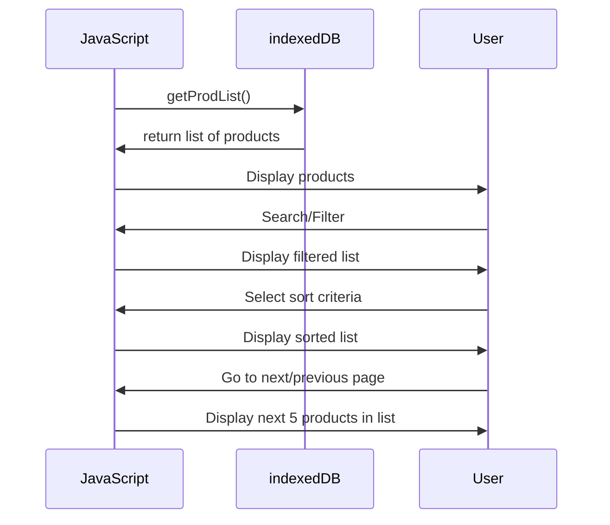

This feature is the Marketplace Page. The Marketplace Page displays a list of every product in the database to the user. The user can sort and filter the list, and search for specific products. The Marketplace displays 5 items at a time, with buttons to go to the next and previous "page" of the list.
